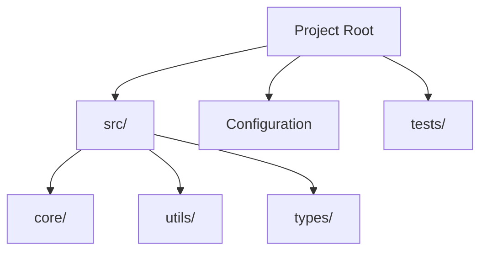
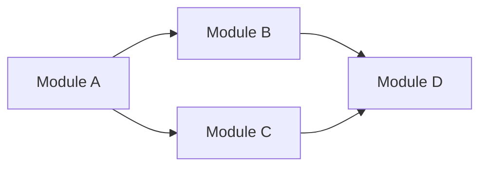
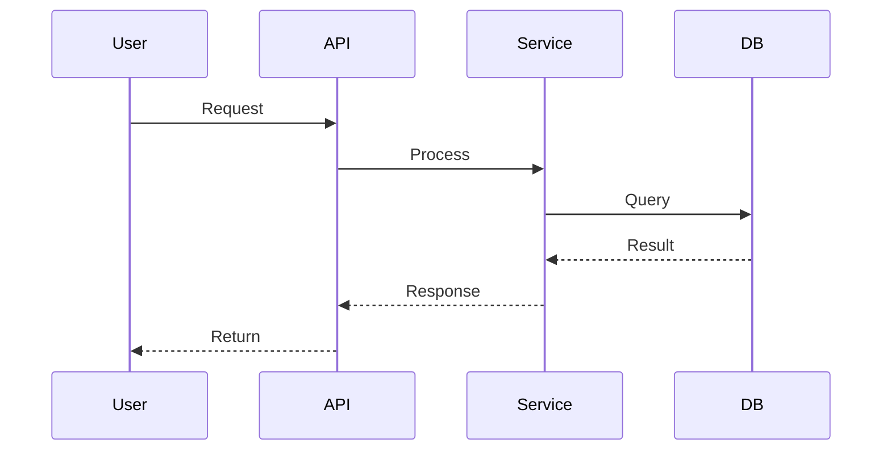
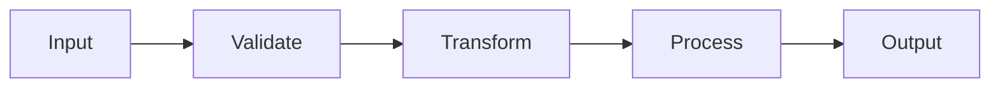
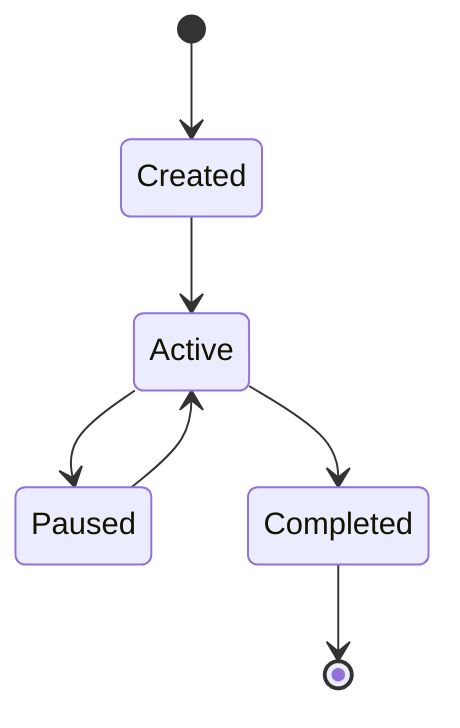
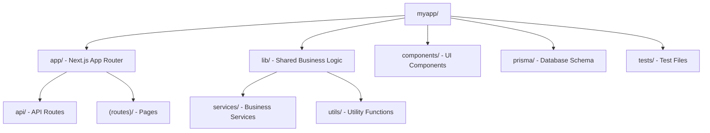
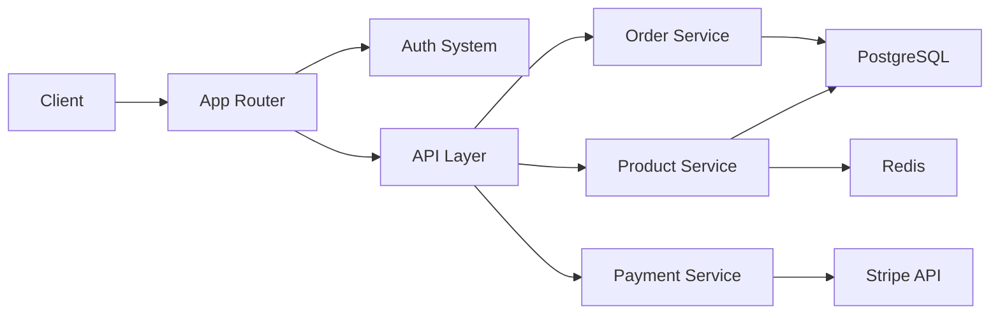
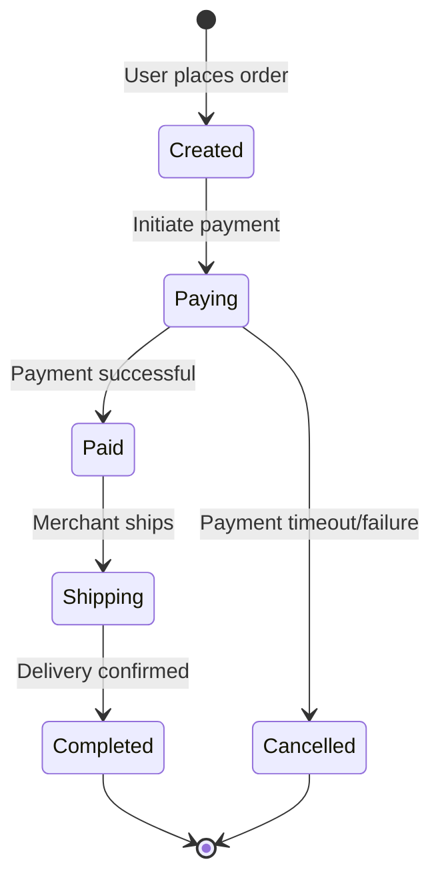

# RepoWiki - Repository Report Generator

Generate a DeepWiki-style in-depth analysis report based on the current repository's code structure, configuration files, and dependency relationships.

## Report Structure Specification

The generated report must strictly follow the layered structure below, output as a single Markdown file.

### Layer 1: Project Overview

```markdown
# {Project Name}

> {One-line project positioning description}

## Purpose & Scope

{2-3 paragraphs describing what problem the project solves, core value, target users}

## Tech Stack

| Category | Technology | Purpose |
|----------|-----------|---------|
| Language | ... | ... |
| Framework | ... | ... |
| Build Tool | ... | ... |
| Testing | ... | ... |
| Database | ... | ... |

## Repository Structure

{Mermaid graph showing top-level directory structure and module relationships}

## Core Systems Overview

{Mermaid graph showing interactions between major subsystems}
```

### Layer 2: Module & Package Analysis

```markdown
## Module Inventory

| Module | Path | Responsibility | Key Dependencies |
|--------|------|---------------|-----------------|
| ... | ... | ... | ... |

## Module Dependency Architecture

{Mermaid graph: inter-module dependency diagram}

## {Module Name} Detailed Analysis

<details>
<summary>Related Source Files</summary>

- `path/to/file1.ts`
- `path/to/file2.ts`
</details>

### Responsibilities & Boundaries
{What this module is and isn't responsible for}

### Internal Architecture
{Mermaid graph: class/function relationships within the module}

### Key Interfaces
{Code block: main exported APIs, type definitions, interfaces}

### Data Flow
{Mermaid sequence/flowchart: how data flows within the module}
```

### Layer 3: Core System Deep Analysis

Generate an independent section for each core system:

```markdown
## {System Name}

<details>
<summary>Related Source Files</summary>

- `path/to/relevant/file.ts`
</details>

### Purpose & Scope
{Description of the system's responsibilities}

### System Architecture
{Mermaid graph: overall architecture diagram of the system}

### Core Workflows
{Mermaid sequence diagram: main business processes}

### Key Components

| Component | File | Responsibility |
|-----------|------|---------------|
| ... | ... | ... |

### Configuration & Extension Points
{Code block: key configuration file snippets}

### Design Decisions
{Why it was designed this way, what trade-offs were made}
```

### Layer 4: Infrastructure & Toolchain

```markdown
## Build System

### Build Pipeline
{Mermaid flowchart: complete process from source to artifacts}

### Build Configuration
{Table: key build configuration items}

## Testing Infrastructure

### Testing Strategy
| Test Type | Tool | Coverage |
|-----------|------|----------|
| Unit Tests | ... | ... |
| Integration Tests | ... | ... |
| E2E Tests | ... | ... |

### Test Configuration
{Code block: key test configuration file snippets}

## CI/CD Pipeline
{Mermaid flowchart: CI/CD process}

## Dependency Management
### Key Dependencies
| Dependency | Version | Purpose |
|-----------|---------|---------|
| ... | ... | ... |

### Dependency Strategy
{Version locking, update strategy, security auditing}
```

## Mermaid Diagram Specifications

Each report must include the following types of diagrams:

### 1. Repository Structure Diagram (Required)



### 2. Module Dependency Diagram (Required)



### 3. Core Workflow Diagram (Required)



### 4. Data Flow Diagram (As Needed)



### 5. State/Lifecycle Diagram (As Needed)



## Analysis Execution Flow

### Step 1: Collect Repository Metadata

Use the following tools to gather information (execute in parallel):

1. **Directory Structure** - Use Glob to scan `**/*` for the complete file tree
2. **Package Management** - Read `package.json`, `go.mod`, `Cargo.toml`, `pyproject.toml`, `pom.xml`, etc.
3. **Configuration Files** - Read `tsconfig.json`, `.eslintrc.*`, `vite.config.*`, `webpack.config.*`, etc.
4. **CI/CD** - Read `.github/workflows/*`, `.gitlab-ci.yml`, `Dockerfile`, etc.
5. **Git History** - Get file change frequency from the last 100 commits

### Step 2: Identify Core Systems

Determine core systems based on the following signals:

| Signal | Weight | Method |
|--------|--------|--------|
| File change frequency | High | git log statistics |
| Directory size | Medium | File count |
| Entry file references | High | grep import/require |
| README mentions | Medium | Read documentation |
| Export count | Medium | grep export |

### Step 3: Deep Analysis of Each System

For each core system, perform:

1. Read all files in that directory
2. Identify main class, function, and type definitions
3. Trace import/export dependency chains
4. Identify design patterns (Repository, Factory, Observer, etc.)
5. Extract key configurations and constants

### Step 4: Generate Mermaid Diagrams

Based on the analysis results, generate:
- At least 1 architecture overview diagram
- At least 1 module dependency diagram
- At least 1 core workflow sequence diagram
- Add state diagrams and data flow diagrams as needed

### Step 5: Assemble Report

Assemble the complete report according to the structure specification above, output to `REPOWIKI.md`.

## Source File Reference Specification

Each section must include collapsible source file references:

```markdown
<details>
<summary>Related Source Files</summary>

- `src/core/engine.ts` - Core engine implementation
- `src/core/types.ts` - Type definitions
- `src/config/default.ts` - Default configuration
</details>
```

Reference rules:
- Only reference files **directly related** to the current section
- Each reference includes a brief description
- Sort by importance, most critical files first
- 3-10 referenced files per section

## Table Usage Specification

Tables **must** be used in the following scenarios:

1. **Tech Stack** - Inventory of languages, frameworks, and tools
2. **Module Inventory** - Paths, responsibilities, and dependencies of all modules
3. **Configuration Comparison** - Configuration differences across environments/modes
4. **API Inventory** - Methods, parameters, and return values of public APIs
5. **Dependency Inventory** - Versions and purposes of key dependencies

## Output Requirements

1. **Filename**: `REPOWIKI.md`, placed in the repository root
2. **Language**: Match the user's conversation language (Chinese conversation = Chinese report)
3. **Length**:
   - Small projects (<50 files): 800-1500 lines
   - Medium projects (50-200 files): 1500-3000 lines
   - Large projects (>200 files): 3000-6000 lines
4. **Diagram count**: At least 3 Mermaid diagrams, 6-10 for large projects
5. **Table count**: At least 3 tables
6. **Code blocks**: Key configurations and interface definitions, no more than 30 lines each

## Quality Checklist

After generating the report, verify the following items:

- [ ] Contains project overview and one-line positioning
- [ ] Tech stack table is complete and accurate
- [ ] Repository structure Mermaid diagram matches reality
- [ ] Each core system has an independent section
- [ ] Each section has collapsible source file references
- [ ] Module dependency diagram correctly reflects actual dependencies
- [ ] At least one sequence diagram shows core workflows
- [ ] All tables are correctly formatted with accurate content
- [ ] Code block syntax highlighting is correct
- [ ] No fabricated files or modules
- [ ] Mermaid diagram syntax is correct and renderable

## Example Snippet

Below is a report snippet example for a TypeScript web project:

```markdown
# MyApp

> A full-stack e-commerce platform built on Next.js, supporting multi-tenancy and real-time inventory management.

## Purpose & Scope

MyApp is an e-commerce SaaS platform for small and medium-sized merchants. It provides
product management, order processing, payment integration, and real-time inventory
synchronization as core features. The project uses Next.js App Router architecture,
Prisma as the ORM, and PostgreSQL as the primary database.

## Tech Stack

| Category | Technology | Purpose |
|----------|-----------|---------|
| Language | TypeScript 5.3 | Full-stack development language |
| Framework | Next.js 14 | Full-stack React framework |
| ORM | Prisma 5.8 | Database access layer |
| Database | PostgreSQL 16 | Primary data storage |
| Cache | Redis 7 | Session and hot data caching |
| Testing | Vitest + Playwright | Unit and E2E testing |

## Repository Structure



## Core Systems Overview



## Order System

<details>
<summary>Related Source Files</summary>

- `lib/services/order.ts` - Order service core logic
- `app/api/orders/route.ts` - Order API routes
- `prisma/schema.prisma` - Order data model
- `lib/validators/order.ts` - Order data validation
- `components/order/OrderForm.tsx` - Order form component
</details>

### Purpose & Scope

The order system manages the complete order lifecycle from shopping cart to payment completion.
This includes order creation, inventory locking, payment processing, status transitions, and notification delivery.

### Order Lifecycle


```

## Language/Framework Adaptation

Adjust analysis focus based on project type:

| Project Type | Analysis Focus |
|-------------|---------------|
| Node.js/TypeScript | package.json, tsconfig, module exports |
| Go | go.mod, package structure, interface definitions |
| Python | pyproject.toml, package structure, class hierarchy |
| Rust | Cargo.toml, crate structure, trait definitions |
| Java/Kotlin | pom.xml/build.gradle, package structure, class hierarchy |
| Monorepo | workspace config, inter-package dependencies, build order |
| Frontend SPA | routing structure, state management, component tree |
| Backend API | route definitions, middleware chain, data models |
| CLI Tool | command structure, argument parsing, subcommands |
